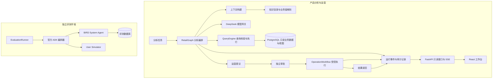

# CommerceAnalyst

**面向电商经营分析与受控运营协同的 AI Agent 系统。**

CommerceAnalyst 将自然语言问题、业务知识、数据库查询和运营审批连接起来，为分析人员提供可追溯的数据分析过程，为运营人员提供有明确授权边界的行动流程。系统采用独立的分析与执行权限，通过查询策略、审批状态机和事件记录，让每一步分析和操作都有据可查。

当前参考业务域基于 Olist 2016–2018 年匿名历史电商数据，覆盖订单、商品、卖家、支付、履约和评价。仓库同时提供 Web 工作台、产品场景评测，以及独立的 BIRD-Interact 交互式数据库评测集成。

## 核心能力

| 能力 | 实现方式 |
| --- | --- |
| 经营分析 | 结合业务上下文与数据库 Schema 编排分析任务，通过只读 SQL 获取结果 |
| 业务语义理解 | 维护表、列、关联关系、指标和数据质量知识，支持业务值别名解析与 BM25 检索 |
| 查询治理 | 基于 SQL AST 的策略校验、函数约束、EXPLAIN 阈值检查和数据库只读权限 |
| 受控运营 | 将提议、审批、执行与结果读回分离，支持 HMAC 授权、一次性 nonce 和幂等控制 |
| 过程追踪 | 记录运行事件，通过 SSE 向工作台提供事件流，支持 Last-Event-ID 断线续传 |
| 模型接入 | 使用 DeepSeek 模型网关，集中处理能力快照、请求关联、响应校验和协议诊断 |
| 质量评估 | 通过产品场景测试、对照实验和 BIRD-Interact 评测分别验证流程行为与任务效果 |

典型分析问题包括品类表现、支付与订单金额对账、卖家履约情况和客户评价分布。具体结论取决于数据完整性、指标定义和模型输出，应结合查询证据进行复核。

## 系统架构



### 分析与执行分离

`RetailGraph` 负责分析和提议，不持有运营执行能力。`OperationWorkflow` 管理提议、决策和执行状态，要求申请与审批主体分离，并在执行时验证授权。查询、知识访问、状态持久化、审批和执行使用不同的数据库角色。

### 产品与评测分离

产品链路面向经营分析和受控运营；BIRD 链路通过独立服务与数据库环境运行交互式任务。评测执行器提供任务恢复、并发控制和结果导入，避免将评测环境与产品业务访问混用。

### 工作台接入边界

工作台包含分析视图、审批展示与评测中心，提供两种模式：

- **演示模式**：使用内置事件展示分析与运营流程，可独立启动前端体验。
- **实时模式**：读取后端已有运行记录、事件流和评测数据。

当前 HTTP API 为只读接口。实时工作台用于观察已有任务；发起分析和执行审批需由应用层接入对应工作流，不能仅通过启动 Web 服务完成。

## 技术栈

| 层次 | 技术 |
| --- | --- |
| 后端 | Python 3.11、FastAPI、Pydantic |
| Agent 编排 | LangGraph、PostgreSQL Checkpointer |
| 数据与迁移 | PostgreSQL、Psycopg、SQLAlchemy、Alembic |
| 查询与检索 | SQLGlot、BM25 |
| 前端 | React 19、TypeScript、Vite 7、ECharts |
| 开发与验证 | uv、pytest、Ruff、Docker Compose |

Python 依赖由 `uv.lock` 锁定，前端依赖由 `web/package-lock.json` 锁定。

## 快速开始

### 1. 准备环境

- Python 3.11 与 uv。
- 与 Vite 7 兼容的 Node.js 和 npm。
- 接入数据库时需要 Docker Compose 或已配置的 PostgreSQL。
- 调用真实模型时需要 DeepSeek API Key；前端演示无需模型凭据。

在仓库根目录安装后端依赖：

```bash
uv sync --locked
```

### 2. 启动前端演示

```bash
cd web
npm ci
npm run dev
```

打开终端显示的本地地址，默认端口为 `5173`。工作台默认使用演示模式。

### 3. 配置后端环境

将根目录的 `.env.example` 复制为 `.env`，按需填写环境变量。已有 `.env` 时保留现有配置。

| 配置 | 用途 |
| --- | --- |
| `DEEPSEEK_BASE_URL`、`DEEPSEEK_API_KEY` | 模型服务地址与凭据 |
| `PRODUCT_POSTGRES_IMAGE` | Compose 使用的 PostgreSQL 镜像，要求指定 digest |
| `PRODUCT_POSTGRES_ADMIN_PASSWORD`、`PRODUCT_POSTGRES_ADMIN_DSN` | 数据库初始化与迁移 |
| `PRODUCT_DATABASE_DSN` | 业务查询和只读 API 连接 |
| `PRODUCT_KNOWLEDGE_DATABASE_DSN` | 知识读取连接 |
| `PRODUCT_CHECKPOINT_DATABASE_DSN`、`PRODUCT_MODEL_STATE_DATABASE_DSN` | 编排检查点与模型状态连接 |
| `PRODUCT_PROPOSAL_DATABASE_DSN`、`PRODUCT_APPROVAL_DATABASE_DSN`、`PRODUCT_OPERATION_DATABASE_DSN` | 提议、审批与执行连接 |
| `PRODUCT_TRACE_DATABASE_DSN` | 运行事件写入连接 |
| `PRODUCT_OPERATION_APPROVAL_HMAC_KEY_V1`、`PRODUCT_SELLER_REF_HMAC_KEY_V1` | 操作授权和卖家引用签名 |

各角色的密码变量见 `.env.example`，角色 DSN 应使用对应身份，不能统一替换为管理员连接。完整数据库初始化还需要设置 `PRODUCT_EVALUATION_WRITER_PASSWORD`，该变量由评测角色初始化脚本读取。

### 4. 初始化本地数据库

以下命令用于已完成上述配置的新建开发环境，按顺序在仓库根目录运行：

```bash
docker compose up -d --wait product-postgres
uv run --env-file .env python scripts/bootstrap_product_db.py
uv run --env-file .env python scripts/bootstrap_runtime_state.py roles
uv run --env-file .env python scripts/bootstrap_day4_operations.py
uv run --env-file .env python scripts/bootstrap_day5_evaluation_env.py
uv run --env-file .env alembic upgrade head
uv run --env-file .env python scripts/bootstrap_runtime_state.py checkpoint
```

Compose 默认将数据库绑定至 `127.0.0.1:5432`，并使用命名卷持久化数据。数据导入与 Schema 初始化分开执行：

- `scripts/import_olist.py`：通过 `--dataset-dir` 和 `--manifest` 指定数据目录与清单；导入时检查文件、行数和金额对账结果。参考清单位于 `data/manifests/olistbr-brazilian-ecommerce-v2-manifest.json`。
- `scripts/build_knowledge_catalog.py`：构建业务知识目录。
- `scripts/import_knowledge.py`：将知识目录导入数据库。

原始数据需要单独准备。初始化空数据库不会自动生成业务数据、分析任务或评测记录。

### 5. 启动只读 API

```bash
uv run --env-file .env python scripts/run_api.py
```

服务默认监听 `127.0.0.1:8010`，可通过 `COMMERCE_AGENT_API_HOST` 和 `COMMERCE_AGENT_API_PORT` 调整。启动脚本统一配置异步事件循环，兼顾 Windows 下的 Psycopg 连接要求。

前端开发服务器将 `/api` 代理至 `http://127.0.0.1:8010`。后端端口变化时，需同步调整 `web/vite.config.ts`。切换至实时模式后，工作台读取数据库中已有的运行记录。

## API 概览

| 方法 | 路径 | 说明 |
| --- | --- | --- |
| GET | `/api/runs` | 获取运行列表 |
| GET | `/api/runs/{run_id}/events` | 订阅运行事件流，支持 SSE 重连 |
| GET | `/api/eval/experiments` | 获取评测实验列表 |
| GET | `/api/eval/experiments/{experiment_id}/attempts` | 获取实验任务尝试记录 |

服务启动后，可通过 `/docs` 查看 OpenAPI 交互文档。

## 开发与验证

首次运行相关离线测试前，准备并校验 tokenizer 工件：

```bash
uv run python scripts/provision_deepseek_tokenizer.py install --manifest configs/model/deepseek-tokenizer-artifact.v1.json
```

运行不依赖 PostgreSQL 和真实模型调用的测试，以及静态检查：

```bash
uv run pytest -q -m "not postgres and not deepseek"
uv run ruff check src tests scripts db/migrations
```

完成测试数据库配置后，运行 PostgreSQL 集成与端到端测试：

```bash
uv run --env-file .env pytest tests/integration tests/e2e -m postgres -q
```

数据库测试应使用独立测试环境。前端生产构建在 `web` 目录执行：

```bash
npm run build
```

测试分为 `unit`、`contract`、`integration` 和 `e2e` 四层，分别覆盖模块逻辑、接口契约、数据库与服务集成，以及完整业务流程。测试通过与模型任务正确率属于不同指标，需要分别评估。

## 评测体系

**产品评测**围绕业务场景验证分析行为和运营闭环，并支持全量 Schema 与检索上下文的对照实验。入口为 `scripts/build_product_question_bank.py` 和 `scripts/run_product_eval.py`。

**BIRD-Interact 评测**通过官方交互协议运行数据库任务。相关入口包括 `compose.bird.yaml`、`scripts/preflight_bird_stack.py`、`bird_system_agent/` 与 `src/commerce_agent/evaluation/`。该链路需要单独准备官方依赖、评测数据与服务配置，不属于前端演示的启动依赖。

评测记录区分基础设施异常、任务执行状态与任务得分。执行完成不代表答案正确；对外报告应以对应数据集、模型配置和评分口径下的实际结果为依据。

## 目录结构

```text
src/commerce_agent/
  api/                 只读 HTTP API 与 SSE
  orchestration/       分析编排与评测适配
  operations/          运营提议、审批和受控执行
  query_engine/        SQL 策略与只读查询
  knowledge/           业务知识目录与检索
  value_resolver/      业务值和别名解析
  context_builder/     模型上下文构建
  model/               模型网关与状态管理
  evaluation/          交互式评测执行与记录
  product_eval/        产品场景评测
bird_system_agent/     BIRD System Agent 服务
web/                   Web 工作台
configs/               模型与运行配置
db/migrations/        数据库版本迁移
scripts/               初始化、导入与评测工具
tests/                 分层测试
data/                  数据清单与知识资源
```

## 部署与接入说明

仓库提供本地开发与集成验证入口。部署到企业环境时，需要结合现有基础设施接入身份认证、访问控制、密钥管理、监控告警和数据备份。当前默认配置绑定本机地址，HTTP 层未提供完整的企业身份体系。

接入新的电商数据源时，应同步维护 Schema、指标口径、业务知识、数据访问策略和回归场景。运营动作应通过独立审批与执行工作流接入，并保留结果读回和审计记录。

参考数据为历史匿名数据，系统当前版本为 `0.1.0`。业务适用性与模型分析质量应在目标数据和实际场景下验证，不能由演示结果或流程测试推定。
